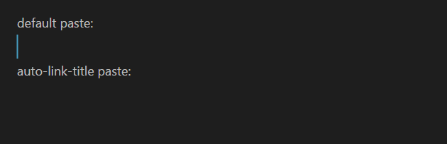

## Obsidian Auto Link Title

This plugin automatically fetches link titles when they're pasted using the shortcut `ctrl+shift+b` or `cmd+shift+b`

For example:
When pasting `https://github.com/zolrath/obsidian-auto-link-title` the plugin fetches the page and retrieves the title, resulting in a paste of: [zolrath/obsidian-auto-link-title: Automatically fetch the titles of pasted links](https://github.com/zolrath/obsidian-auto-link-title)
 
Personally, I'm using [hotkey-helper](https://github.com/pjeby/hotkey-helper) to reassign the hotkey to `ctrl+v` which results in this behavior occurring for every URL pasted into Obsidian.
